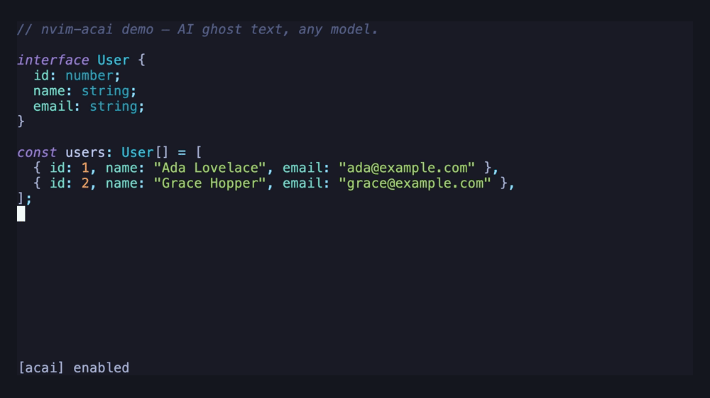

# nvim-acai

AI inline autocomplete for Neovim. Ghost text suggestions as you type, like Copilot — but works with **any AI provider**.

<p align="center">
  
</p>

Supports [OpenRouter](https://openrouter.ai), OpenAI, Anthropic, and any OpenAI-compatible API (Groq, Ollama, Together, etc).

## Requirements

- Neovim >= 0.10
- `curl` in PATH
- API key for your chosen provider

## Install

### lazy.nvim

```lua
{
  "ofcRS/nvim-acai",
  event = "InsertEnter",
  opts = {
    provider = "openrouter", -- "openai", "anthropic", or "openrouter"
  },
}
```

## Setup

Set your API key as an environment variable:

```bash
# Pick one:
export OPENROUTER_API_KEY="sk-or-..."
export OPENAI_API_KEY="sk-..."
export ANTHROPIC_API_KEY="sk-ant-..."
```

Then call setup with your preferred provider:

```lua
require("acai").setup({
  provider = "openrouter",
})
```

Run `:AcaiStatus` to verify the plugin is loaded and your key is detected.

## Config

All options with defaults:

```lua
require("acai").setup({
  provider = "openrouter",
  providers = {
    openrouter = {
      api_key_env = "OPENROUTER_API_KEY",
      api_base = "https://openrouter.ai/api/v1",
      model = "anthropic/claude-sonnet-4",
      max_tokens = 256,
      temperature = 0.0,
    },
    openai = {
      api_key_env = "OPENAI_API_KEY",
      api_base = "https://api.openai.com/v1",
      model = "gpt-4o-mini",
      max_tokens = 256,
      temperature = 0.0,
    },
    anthropic = {
      api_key_env = "ANTHROPIC_API_KEY",
      api_base = "https://api.anthropic.com/v1",
      model = "claude-sonnet-4-20250514",
      max_tokens = 256,
      temperature = 0.0,
    },
  },
  completion = {
    debounce_ms = 200,
    max_context_chars = 4096,
    auto_trigger = true,
    filetypes_exclude = {},
  },
  ghost_text = {
    hl_group = "AcaiGhostText",
  },
  keymaps = {
    accept = "<Tab>",
    accept_word = "<M-Right>",
    accept_line = "<C-e>",
    dismiss = "<C-]>",
    suggest = "<M-Bslash>",
  },
})
```

### Using a custom OpenAI-compatible endpoint

Point any provider at a local or third-party API:

```lua
require("acai").setup({
  provider = "openai",
  providers = {
    openai = {
      api_key_env = "OLLAMA_API_KEY", -- or set to any non-empty value
      api_base = "http://localhost:11434/v1",
      model = "codellama",
    },
  },
})
```

## Keymaps

All keymaps are active in insert mode. `<Tab>` falls through to its normal behavior when no suggestion is visible.

| Key | Action |
|---|---|
| `<Tab>` | Accept full suggestion |
| `<M-Right>` | Accept first word |
| `<C-e>` | Accept first line |
| `<C-]>` | Dismiss suggestion |
| `<M-\>` | Manually trigger suggestion |

Set any keymap to `false` to disable it:

```lua
opts = {
  keymaps = {
    accept = "<C-y>",    -- remap accept
    accept_word = false,  -- disable accept_word
  },
}
```

## Commands

| Command | Description |
|---|---|
| `:AcaiEnable` | Enable completions |
| `:AcaiDisable` | Disable completions |
| `:AcaiToggle` | Toggle on/off |
| `:AcaiStatus` | Show provider, model, and API key status |

## How it works

1. You type in insert mode
2. After a 200ms debounce, the plugin extracts buffer context around your cursor
3. Sends it to your configured AI provider via async `curl`
4. Renders the response as ghost text (inline extmarks)
5. Press `<Tab>` to accept, keep typing to dismiss

Stale requests are automatically cancelled when you keep typing. Ghost text is suppressed when blink.cmp or nvim-cmp popups are visible.

## License

MIT
